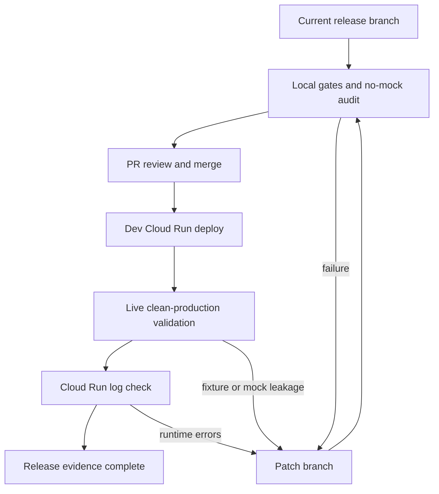

## Goal Capsule

| Field | Plan |
| --- | --- |
| Objective | Land the current no-mock runtime UI/API cleanup, deploy it to dev, and prove the live app no longer exposes fixture/demo/static operational data outside explicitly gated fixture mode. |
| Authority | Backend API and persisted workflow state remain the source of truth; authenticated session claims provide UI actor identity; Cloud Run deployment state proves the live result. |
| Execution profile | Finish with a small release branch, one PR, a normal merge to `main`, a dev deploy with fixture mode disabled, and a live audit against clean production routes. |
| Stop conditions | Stop if gates fail, actor/session claims are missing in deployed web, fixture controls render without explicit fixture mode, `/demo/run` remains reachable by default, or live routes show seeded operational values on clean data. |
| Tail ownership | The implementer owns branch hygiene through live validation and must leave a clean worktree except intentional committed artifacts. |

---

## Product Contract

### Summary

Coverset should ship the current branch only after the runtime UI/API paths that previously leaked demo defaults, fixture switches, fake actors, or client-fabricated operational data are guarded or data-driven.
The shipped app should still support explicit fixture smoke workflows for development, but those paths must be opt-in and visually absent from normal runtime UI.

### Problem Frame

The prior reviewer blocker was not that tests used fixtures or that static `docs/ui-sling` references exist; it was that runtime product surfaces could create, display, or submit operational-looking data that did not come from backend workflow state or authenticated user input.
The release has to preserve the real workflow implementation while proving that normal users see empty/operator-entered setup, session-derived actor authority, persisted backend state, and no always-on demo shortcuts.

### Requirements

- R1. Runtime production setup starts from operator-entered data, not prefilled demo title, cast, location, or shoot dates.
- R2. Fixture/demo controls and fixture backend workflows are disabled by default and only available behind explicit fixture-mode configuration.
- R3. Runtime actor identity comes from authenticated/session claims, with no default all-role development actor exposed to the UI.
- R4. Role-gated operational actions use the appropriate authenticated role: First AD for board selection, Second AD for call sheets, Script Supervisor for actuals, Director for pickup request, and UPM or line producer for cost approval.
- R5. Replan, coverage, pickup, and cost-approval submissions use backend state plus operator-entered values; the UI must not synthesize fake monitor IDs, fingerprints, actuals, pickup specs, or added shoot days.
- R6. Existing API compatibility for direct callers remains intact through neutral direct-API actor defaults when no trusted actor headers are present.
- R7. Regression coverage prevents previously blocked markers and behaviors from returning to normal runtime paths.
- R8. Dev deployment and live validation prove the merged `main` revision behaves like the tested branch.

### Actors

- A1. Authenticated production operator: creates productions, uploads scripts, and performs allowed workflow actions according to session roles.
- A2. First AD: selects boards and accepts human constraints.
- A3. Second AD: generates call sheets.
- A4. Script Supervisor: records coverage actuals and locks days.
- A5. Director: requests pickup work from coverage findings.
- A6. UPM or line producer: approves or rejects cost-gated revised boards.
- A7. Release owner: commits, opens PR, merges, deploys, and validates the live dev environment.

### Acceptance Examples

- AE1. Given normal fixture mode is not enabled, when a user opens the root app, then the production title is blank, demo seed controls are absent, fixture demo navigation is absent, and create/reset is disabled until a title is entered.
- AE2. Given no trusted actor claim exists, when workflow screens load, then the UI shows an unauthenticated actor state and role-gated buttons are disabled rather than impersonating an all-role development user.
- AE3. Given a board is loaded and a session has a Second AD role, when a call sheet is generated, then the request uses the authenticated session actor instead of a hardcoded name.
- AE4. Given a clean production has no seeded workflow state, when operational screens load, then rows and cards are empty or backend-derived; they do not show Ferry Job, fake location IDs, synthetic dates, fixture actuals, or placeholder monitor data.
- AE5. Given fixture mode remains disabled in dev, when the API receives a request to the demo endpoint, then the request is rejected instead of creating a demo production.

### Scope Boundaries

- In scope: current branch cleanup, tests, PR/merge, dev deploy, and live no-mock validation.
- In scope: preserving explicit fixture smoke capability as a disabled-by-default development path.
- In scope: documenting validation evidence in the PR or release notes.
- Out of scope: pixel-perfect v4 screenshot parity work.
- Out of scope: removing test fixtures, Playwright mocks, authored corpus files, or static `docs/ui-sling` reference HTML.
- Out of scope: changing Cloud Run privacy posture or replacing backend-owned solver/API authority.

---

## Planning Contract

### Key Technical Decisions

- KTD1. Gate fixtures rather than delete them. Fixture workflows are still useful for smoke tests and local debugging, but normal runtime must not expose or execute them without explicit configuration.
- KTD2. Prefer empty/operator-entered root state over neutral fake defaults. Blank setup is more truthful than replacing the Ferry Job with another plausible-looking placeholder production.
- KTD3. Keep backend authority unchanged. UI role checks improve affordances, but FastAPI role enforcement and persisted workflow records remain the security and data-integrity boundary.
- KTD4. Use neutral direct-API actor labels only for headerless compatibility. This preserves old direct API clients without presenting a fake authenticated user in the web session.
- KTD5. Live validation uses clean production state, not the demo endpoint. The release proof should exercise the path users see by default.

### High-Level Technical Design

### Assumptions

- Normal dev deployment does not set `COVERSET_ENABLE_FIXTURE_MODE=1` or `NEXT_PUBLIC_COVERSET_ENABLE_FIXTURE_MODE=1`.
- Existing dev Cloud Run web session claim configuration continues to provide the expected actor roles for live validation.
- The release owner has `spoonepa@gmail.com` active for deploy and authenticated Cloud Run validation.
- Existing visual-reference files remain non-runtime artifacts and do not need modification for this release.

### Sequencing

Freeze and review the branch before committing, merge only after gates are green, deploy only from merged `main`, and run live validation only against the deployed revision.
If any live validation fails, reopen the branch or create a follow-up fix branch rather than claiming the current release complete.

### Sources & Research

- Current branch diff touches root UI, full workflow screens, auth claims, API fixture gates, neutral actor defaults, deploy smoke behavior, and regression tests.
- Prior no-mock audit identified the blocked runtime leakage classes: root demo defaults, visible fixture controls, fallback all-role actor, hardcoded call-sheet actor, fabricated monitor metadata, static coverage actuals, static pickup specs, and cost-approval fallback dates.
- Local validation already demonstrated the intended gate set can pass; final execution still needs branch landing, deploy, and live proof from merged `main`.

---

## Implementation Units

### U1. Freeze branch and confirm no runtime fixture regressions

- **Goal:** Ensure the current branch contains only intentional no-mock cleanup changes and no build-generated drift before commit.
- **Requirements:** R1, R2, R3, R5, R7.
- **Dependencies:** None.
- **Files:** `apps/web/app/page.tsx`, `apps/web/components/screens/full-ui-workflows.tsx`, `apps/web/shared/auth-claims.ts`, `src/coverset/api/config.py`, `src/coverset/api/main.py`, `src/coverset/api/schemas.py`, `src/coverset/api/services.py`, `src/coverset/api/constraints_io.py`, `src/coverset/api/models.py`, `src/coverset/constraint_translation.py`, `scripts/deploy_dev.sh`, `apps/web/tests/full-ui.spec.ts`, `apps/web/tests/p1-flow.spec.ts`, `tests/test_api.py`.
- **Approach:** Review the final diff for intentional behavior changes only: blank root defaults, hidden fixture controls, disabled default demo endpoint, unauthenticated default claims, operator-entered workflow inputs, no fabricated cost dates, and restored build-generated files.
- **Patterns to follow:** Keep shared frontend helpers under `apps/web/shared/`; keep `apps/web/next-env.d.ts` on the tracked non-dev type paths after builds; do not stage ignored Terraform local files.
- **Test scenarios:**
  - Covers AE1. Root page starts with blank title and no fixture controls when fixture mode is not enabled.
  - Covers AE2. Default session claims do not authenticate a development actor or grant roles.
  - Runtime source scan does not find the previously blocked static operational markers outside tests, docs, generated output, or explicitly gated fixture code.
  - Existing deploy-script test marker for billing account interpolation remains unchanged.
- **Verification:** The branch diff is explainable file-by-file, generated drift is absent, and no reviewer-blocking marker remains in normal runtime code paths.

### U2. Preserve automated regression coverage

- **Goal:** Ensure tests prove the new data-driven behavior rather than merely accepting the new implementation.
- **Requirements:** R1, R2, R3, R4, R5, R6, R7.
- **Dependencies:** U1.
- **Files:** `apps/web/tests/p1-flow.spec.ts`, `apps/web/tests/full-ui.spec.ts`, `tests/test_api.py`, `apps/web/app/page.tsx`, `apps/web/components/screens/full-ui-workflows.tsx`, `apps/web/shared/auth-claims.ts`, `src/coverset/api/main.py`, `src/coverset/api/schemas.py`, `src/coverset/api/services.py`.
- **Approach:** Keep assertions focused on the blocked regressions: blank root state, hidden fixture affordances, default-disabled demo endpoint, session-derived call-sheet actor, operator-entered monitor/coverage/pickup payloads, and neutral direct-API actor compatibility.
- **Patterns to follow:** Playwright mocks remain test-only and may use fixture data; production code must not read from those mocks. API tests should opt into fixture mode explicitly when exercising `/demo/run`.
- **Test scenarios:**
  - Covers AE1. Playwright verifies create/reset is disabled until an operator title is entered and demo seed controls are absent by default.
  - Covers AE3. Root call-sheet POST includes the authenticated session actor name and `second_ad` role, and an unauthenticated or non-Second AD session cannot generate a call sheet.
  - First AD board selection tests cover both allowed selection with `first_ad` and denied selection for a non-First AD role.
  - Script Supervisor actuals tests cover allowed day-locking and coverage-finding creation with `script_supervisor`, plus disabled or rejected action when the claim lacks that role.
  - Director pickup tests cover allowed pickup request with `director` and denied request when the claim lacks that role.
  - UPM/line producer cost tests cover allowed approval with `upm` or `line_producer`, denied approval with `first_ad`, and blocked board selection until persisted approval exists.
  - Replan flow posts operator-entered monitor query, external ID, old/new fingerprints, materiality, and change message.
  - Coverage flow posts operator-entered coverage key, type, take label, and outcome.
  - Pickup confirmation posts operator-entered duration and priority, and pickup replan posts operator-entered cutoff timestamp.
  - API rejects `/demo/run` by default and allows it only when fixture mode is explicitly enabled for the test.
- **Verification:** Focused web and API tests pass and would fail if any blocked fake-data or role-bypass path is reintroduced.

### U3. Land the PR from the release branch

- **Goal:** Commit the branch, push it, open a PR, and merge it only after the branch evidence is current.
- **Requirements:** R7, R8.
- **Dependencies:** U1, U2.
- **Files:** `docs/plans/2026-09-03-001-fix-data-driven-runtime-ui-ship-plan.md`, plus all intentional files listed in U1.
- **Approach:** The PR description should call out the reviewer blockers resolved, the fixture-mode default-disabled behavior, the actor-claim change, the operator-entered workflow inputs, and the local validation results.
- **Patterns to follow:** Keep the commit message value-focused; do not include secrets, ignored Terraform files, or generated `next-env` drift.
- **Test scenarios:**
  - PR review can trace each reviewer-blocked leakage class to either a product-code change or a regression assertion.
  - The pushed branch matches the local branch that passed gates.
  - Merge target is `main`, and deploy is not run from an unmerged branch unless explicitly treating it as pre-merge smoke.
- **Verification:** PR is merged to `main` with a clean local worktree after sync.

### U4. Deploy merged `main` to dev with fixture mode disabled

- **Goal:** Put the merged cleanup into the private dev Cloud Run environment without enabling default demo behavior.
- **Requirements:** R2, R3, R4, R8.
- **Dependencies:** U3.
- **Files:** `scripts/deploy_dev.sh`, `infra/terraform/main.tf`, `infra/terraform/providers.tf`, `infra/terraform/variables.tf`.
- **Approach:** Deploy from the merged `main` revision using the active `spoonepa@gmail.com` account. Let the deploy script skip fixture-demo smoke unless fixture mode is intentionally enabled, and preserve existing session-claim environment configuration for the web service.
- **Patterns to follow:** Use `uv run` for Python snippets in scripts; keep Cloud Run private; keep billing/quota Terraform settings and deploy-script interpolation markers intact.
- **Test scenarios:**
  - Deploy completes with API, web, and worker revisions updated to the merged commit.
  - `/readyz` succeeds with authenticated access.
  - `/demo/run` is not part of default deploy smoke when fixture mode is disabled.
  - Web session route returns authenticated claims with expected roles from configuration, not local development fallback.
- **Verification:** Dev service revisions point at the merged commit and fixture mode remains disabled unless deliberately set for a separate smoke run.

### U5. Live validate clean runtime data and logs

- **Goal:** Prove the deployed app satisfies the no-mock runtime requirement on live dev.
- **Requirements:** R1, R2, R3, R4, R5, R8.
- **Dependencies:** U4.
- **Files:** `apps/web/app/page.tsx`, `apps/web/components/screens/full-ui-workflows.tsx`, `apps/web/shared/auth-claims.ts`, `src/coverset/api/main.py`, `src/coverset/api/services.py`.
- **Approach:** Validate a clean production path rather than a seeded demo path: open the private web app through authenticated access, create a non-demo production, inspect workflow routes before backend data exists, and confirm empty/operator-entered states instead of fixture rows.
- **Patterns to follow:** Use authenticated Cloud Run requests or a local Cloud Run proxy; do not print secrets or tokens; separate test-only Playwright mocks from runtime observations.
- **Test scenarios:**
  - Covers AE4. A newly created production without seed data shows no Ferry Job title, no hardcoded cast/location/date rows, and no static workflow records.
  - Covers AE2. Session-dependent buttons are enabled only for roles present in the deployed session claims.
  - Covers AE5. Default dev API rejects the demo endpoint when fixture mode is disabled.
  - Board selection route shows First AD-only affordance and does not expose selectable revised-board action to a session without `first_ad`.
  - Coverage route shows Script Supervisor-only lock/actuals affordances and does not enable them for a session without `script_supervisor`.
  - Coverage pickup route shows Director pickup-request and First AD pickup-confirm gates independently, with each action disabled or rejected when the session lacks the matching role.
  - Cost route shows UPM/line producer-only cost approval, and the revised board remains unselectable until persisted approval exists.
  - Call-sheet route requires Second AD role and uses the deployed session actor rather than any hardcoded name.
  - Replan, coverage, pickup, cost, call-sheet, audit, and infeasible routes show backend-derived empty states or persisted rows only.
  - Cloud Run API, web, and worker logs show no new ERROR entries from the validation window.
- **Verification:** Live evidence supports the statement that normal runtime UI does not expose mocked, fixture, static operational data, or role-bypass actions.

---

## Verification Contract

| Gate | Applies to | Done signal |
| --- | --- | --- |
| `npm --prefix apps/web run lint` | U1, U2 | TypeScript completes with no diagnostics. |
| `npm --prefix apps/web run test:e2e` | U1, U2 | Playwright root and full-UI workflows pass with assertions for blank defaults and operator-entered payloads. |
| `uv run pytest tests/test_api.py -q` | U2 | API tests pass, including default-disabled demo endpoint and explicit fixture-mode opt-in. |
| `./scripts/check.sh` | U1, U2, U3 | Full local project gate passes; restore `apps/web/next-env.d.ts` if the build rewrites it to dev type paths. |
| PR review and merge evidence | U3 | The PR is merged into `main` and local branch sync shows the merge commit. |
| Dev deploy smoke | U4 | API readiness succeeds and deploy smoke does not depend on fixture demo by default. |
| Live clean-production audit | U5 | Clean production routes show no fixture/static operational rows; session claims and role gates behave as configured. |
| Cloud Run log check | U5 | API, web, and worker have no new ERROR logs for the validation window. |

---

## Definition of Done

- The branch is committed, pushed, reviewed, merged to `main`, and deployed to dev from the merged revision.
- Normal root UI contains no prefilled production/cast/location/calendar demo data and no visible fixture/demo controls by default.
- The API `seed_demo_data` default is false, and `/demo/run` is disabled unless fixture mode is explicitly enabled.
- Web actor claims do not grant unauthenticated development roles; call sheet generation uses an authenticated Second AD session claim.
- Replan, coverage, pickup, and cost approval runtime payloads are backend-derived or operator-entered, not fabricated from static UI constants.
- Regression tests and full local gates pass at least once on the final branch state.
- Live dev validation confirms clean productions remain clean and Cloud Run logs stay error-free.
- The worktree is clean after merge/deploy validation except for intentionally retained local-only artifacts, none of which are staged or committed.
