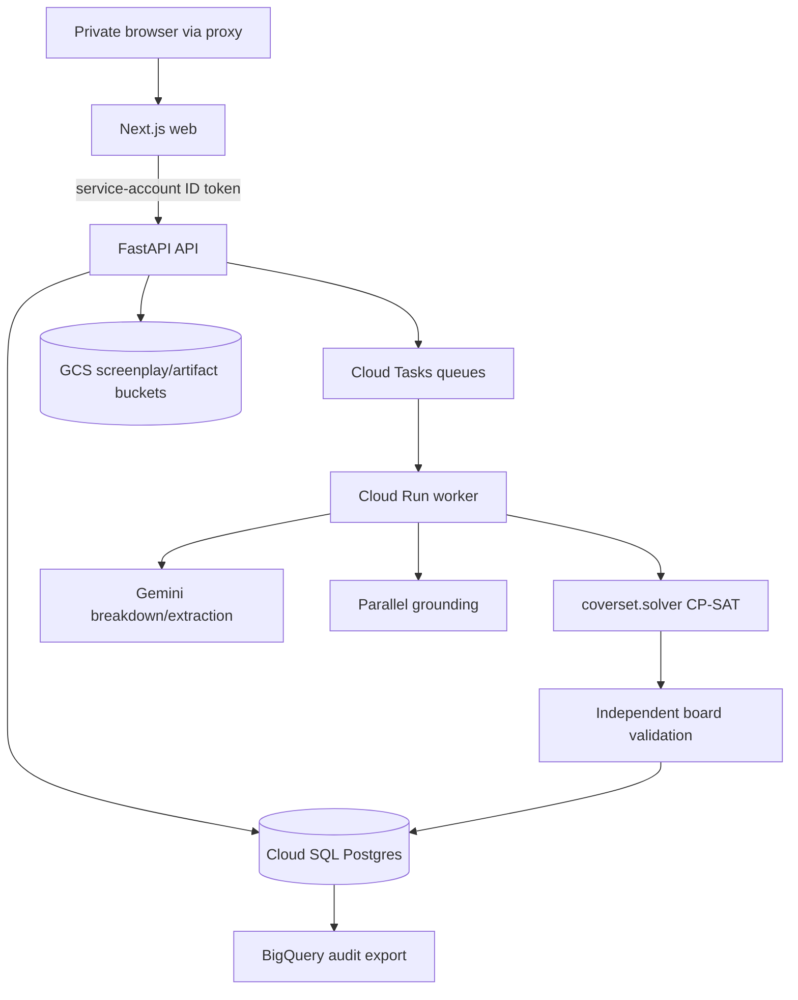
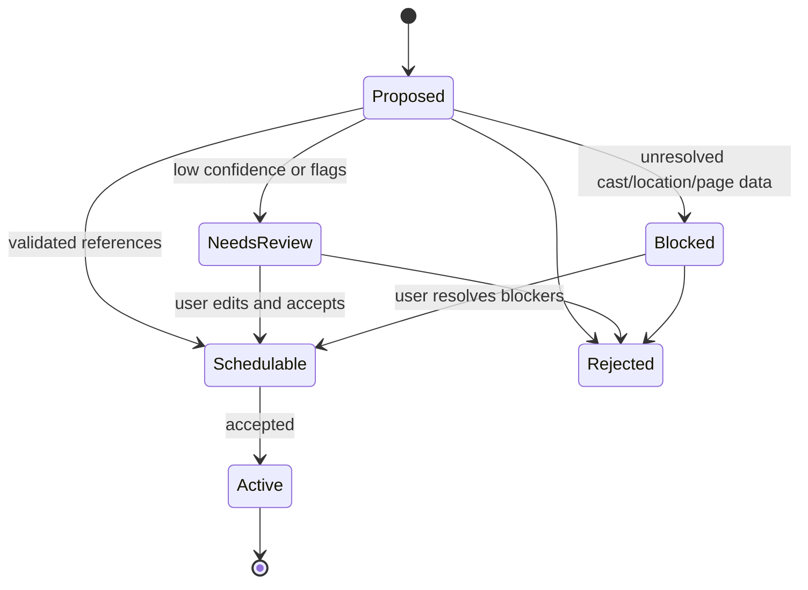

# Coverset Complete Implementation - Plan

## Goal Capsule

| Field | Contract |
| --- | --- |
| Objective | Finish Coverset from the deployed private Cloud Run dev MVP into a usable first-AD scheduling product: screenplay intake, candidate review/edit, deterministic scheduling, board explanation, re-solve, audit, async jobs, and safe cloud operations. |
| Baseline | `main` at `42c9fd5` has private Cloud Run API/web/worker services, Cloud SQL/GCS/Secret Manager/BigQuery/Terraform, fixture demo smoke, deployed web proxy, and a successful live Gemini screenplay smoke. |
| Authority hierarchy | Gemini and Parallel propose candidate facts and evidence only; human/role decisions accept or reject production facts; `coverset.solver.solve()` remains the scheduling authority; validator/audit code proves the solver result before a board is selectable. |
| Execution profile | Implement in the unit order below, using a short branch/PR/deploy loop per phase. Keep the app private during this plan unless U13 adds a deliberate access model. |
| Stop conditions | Stop before merge/deploy if a gate fails, a secret is printed or tracked, an advisory agent can directly select/approve a board, a scheduler output cannot be independently validated, or a live smoke produces unresolved cast/location data without a review path. |
| Completion target | A user can open the private web UI, create production data, upload a screenplay, review/edit candidates, solve and inspect a board, lock/re-solve changes, see why decisions happened, and run the same path through deployed async jobs with audit trails. |

---

## Product Contract

### Summary

Coverset should behave like an agentic scheduling partner, not an autonomous scheduler. It ingests production documents, proposes structured scheduling facts, lets authorized humans validate or correct them, and uses a deterministic constraint solver to generate auditable boards.

The currently deployed UI proves the plumbing. Completion means replacing demo assumptions with real product surfaces and closing the remaining spec areas: review, authority, constraints, locks, pickups, monitoring, audit, exports, and operational safety.

### Problem Frame

The existing system can run an authored fixture and a live Gemini screenplay smoke, but the web product still lacks the screens and workflows that make the result usable. Seeded cast/location data hides the production setup problem; auto-accept hides the candidate-review problem; synchronous endpoints hide the long-running-job problem; plain stripboard text hides the board-inspection problem.

The implementation must not solve those gaps by giving advisory agents more authority. The core product rule remains that model output becomes production fact only through validation and acceptance, and scheduling decisions come only from the deterministic solver plus independent validation.

### Requirements

**Production setup and source intake**

- R1. A user can create and edit production metadata, cast, locations, shoot calendar, company defaults, and baseline constraints without relying on seeded demo data.
- R2. Screenplay assets can be uploaded as text or PDF, stored in GCS/local storage, hashed, and traced to source page/line or extraction span where available.
- R3. Page eighths are computed or edited with a documented rounding rule and enough provenance to audit where the page count came from.

**Candidate breakdown and review**

- R4. Gemini-derived scene records are persisted as candidates with confidence, flags, source provenance, schedulability, unresolved cast/location lists, and review status.
- R5. The UI shows accepted, rejected, blocked, and needs-review candidates separately, with blocking reasons that are understandable without reading raw JSON.
- R6. A user can accept, reject, edit, batch-accept schedulable candidates, and re-run resolution without losing the original model proposal.
- R7. A candidate that is unresolved, below confidence threshold, or flagged for review cannot reach the solver until it is corrected and accepted.

**Grounding, constraints, and advisory boundaries**

- R8. Parallel/Gemini grounding produces typed, provenance-bearing facts for mutable external constraints such as weather, permits, holidays, and union/child-labor references.
- R9. Constraint records remain pluggable and auditable; illustrative defaults are distinguishable from jurisdiction-specific authoritative constraints.
- R10. Advisory agents may summarize, propose, flag, and explain; they may not approve costs, select boards, or decide coverage.

**Scheduling, board selection, and explanations**

- R11. Solver input is derived only from active production facts, accepted schedulable scenes, active constraints, roster, locations, and calendar snapshots.
- R12. Every solver result is independently validated before it can be shown as selectable or accepted.
- R13. The board UI presents day columns, scene strips, cast/location/day-night badges, diagnostics, and conflicts without relying on raw stripboard text.
- R14. A user can inspect why a strip sits where it sits: which constraints, locations, cast availability, daylight windows, locks, and cost weights shaped the assignment.

**Replan, locks, pickups, and monitoring**

- R15. A selected board can be locked by day/strip so replans preserve already-shot or approved production reality.
- R16. A replan can respond to changed facts, omitted work, pickup needs, weather/permit changes, and monitoring findings without rewriting locked history.
- R17. Pickup/added-day paths remain pending until authorized cost approval is recorded.
- R18. Monitoring may create findings and replan requests; it may not choose among boards.

**Authority, audit, export, and operations**

- R19. Decisions that change production facts, candidate acceptance, constraints, board selection, locks, pickups, and cost approval record actor, role, timestamp, before/after values, and provenance.
- R20. Private Cloud Run remains the dev access boundary until app auth or IAP is implemented deliberately.
- R21. Long-running breakdown, grounding, solving, and monitoring work runs through async jobs with status polling and retry/failure records.
- R22. Users can export or copy board artifacts and audit summaries in formats useful for review: rendered board, CSV/JSON, and later PDF.
- R23. The deployment path has no tracked secrets, remote Terraform state, budget/log alerts, Cloud SQL backups, and reproducible Cloud Build deploys.

### Key Flows

- F1. Production setup
  - **Trigger:** User starts a new production.
  - **Actors:** Producer/First AD user in the private dev environment.
  - **Steps:** Create production, add cast, add locations, set calendar, choose default company constraints, save.
  - **Outcome:** Production data exists without seeded demo fixtures and can be used by breakdown resolution.
  - **Covered by:** R1, R9, R19.

- F2. Live screenplay breakdown
  - **Trigger:** User uploads a screenplay.
  - **Actors:** User, API, worker, Gemini.
  - **Steps:** Store asset, hash content, create breakdown job, run Gemini, normalize scene candidates, resolve cast/location IDs, compute schedulability, persist candidates.
  - **Outcome:** UI displays candidates with provenance and review states.
  - **Covered by:** R2, R3, R4, R5, R7, R21.

- F3. Candidate review and correction
  - **Trigger:** User opens a breakdown run.
  - **Actors:** User with deciding authority for production facts.
  - **Steps:** Filter blocked/needs-review scenes, edit slugline/location/cast/page eighths/flags, accept or reject, preserve original proposal and audit events.
  - **Outcome:** Only accepted schedulable scenes are active solver inputs.
  - **Covered by:** R4, R5, R6, R7, R19.

- F4. Solve and inspect board
  - **Trigger:** User asks to solve the accepted scene set.
  - **Actors:** API, worker, deterministic solver, validator.
  - **Steps:** Snapshot inputs, run CP-SAT, validate hard constraints, persist schedule run and board, show board UI with diagnostics and explanation trace.
  - **Outcome:** A validated board is visible and explainable.
  - **Covered by:** R10, R11, R12, R13, R14, R19, R21.

- F5. Lock and re-solve
  - **Trigger:** User marks a day/strip as locked or changes a production fact after a board exists.
  - **Actors:** First AD/authorized user, solver, validator.
  - **Steps:** Persist lock, create replan request, snapshot changed facts, solve alternatives that preserve locked reality, compare old/new boards.
  - **Outcome:** Replan candidates respect locks and make changed work visible.
  - **Covered by:** R15, R16, R19.

- F6. Monitor and pickup
  - **Trigger:** Weather/permit/news/cast finding or missed-scene report arrives.
  - **Actors:** Monitor agent, Script Supervisor/First AD, UPM/Line Producer for added cost.
  - **Steps:** Create finding, request replan or pickup, require authorized approvals, generate board alternatives without selecting automatically.
  - **Outcome:** Production can respond to new facts without advisory agents choosing the board.
  - **Covered by:** R10, R16, R17, R18, R19.

- F7. Export and operate
  - **Trigger:** User needs to share a board or maintain the dev stack.
  - **Actors:** User, API, GCP services.
  - **Steps:** Export board/audit, inspect job history, rely on Cloud Build/Terraform/logging/backup/budget controls.
  - **Outcome:** The deployed product can be demonstrated, audited, and operated safely.
  - **Covered by:** R20, R22, R23.

### Acceptance Examples

- AE1. Given a production with no seeded demo data, when the user creates cast, locations, and a shoot calendar, then a later screenplay breakdown resolves against those saved entities.
- AE2. Given a PDF screenplay upload, when extraction succeeds, then the persisted asset includes a hash and each derived candidate carries source provenance or an explicit missing-provenance reason.
- AE3. Given Gemini proposes a scene with an unknown location, when the breakdown completes, then that candidate is blocked, explains the unresolved location, and cannot feed the solver.
- AE4. Given a blocked candidate, when the user edits it to a known location and accepted cast IDs, then the candidate becomes schedulable and an audit event records the correction.
- AE5. Given accepted schedulable candidates, when the user solves, then the board is produced by CP-SAT, independently validated, persisted, and rendered in the board UI.
- AE6. Given a strip on the board, when the user opens its explanation, then the UI shows the constraints and facts that shaped its assignment.
- AE7. Given a locked shoot day, when a changed fact triggers re-solve, then all alternatives preserve locked assignments and report any unsatisfied work.
- AE8. Given a pickup that adds a day, when the system creates a candidate board, then the board remains pending until a UPM/Line Producer approval is recorded.
- AE9. Given a monitoring finding, when it creates a replan request, then no board is selected until an authorized human selects it.
- AE10. Given the branch is deployed, when the private web proxy posts to `/api/coverset/demo/run` and the API handles a live uploaded screenplay, then both paths return successful persisted boards.

### Scope Boundaries

**In scope for completion:** all user-facing surfaces required to make the existing screenplay-to-board product usable, plus the infrastructure and audit controls needed to run it safely in the current GCP dev project.

**Deferred until after completion:** multi-tenant billing, public marketing-site access, collaboration notifications beyond basic audit/history, full PDF design polish, and provider migrations such as Gemini Enterprise Agent Engine.

**Outside the product identity:** any path where Gemini/Parallel select the final board, approve cost, or silently convert mutable external facts into hard constraints without typed provenance.

---

## Planning Contract

### Key Technical Decisions

- KTD1. Keep `coverset.solver` as the only board-deciding component. API, worker, and UI code can prepare inputs and explain outputs, but they cannot choose a schedule outside the deterministic solver and validator.
- KTD2. Treat review state as the source-of-truth bridge from model output to production fact. Candidate JSON should keep the original proposal and the accepted edited version so audit and rollback remain possible.
- KTD3. Add migrations before expanding schema. Replace startup-only `Base.metadata.create_all()` with Alembic-managed migrations so Cloud SQL and local SQLite can evolve predictably.
- KTD4. Use Cloud Tasks for user-triggered long-running jobs. Pub/Sub remains better for broadcast/event fanout, but Cloud Tasks gives simpler per-job retry, HTTP dispatch, and status mapping for breakdown/solve flows.
- KTD5. Keep the API private and let the web service invoke it with service-account identity. Browser calls go through the Next.js proxy; app-level auth/IAP is a deliberate later unit, not an accidental public exposure.
- KTD6. Make frontend E2E tests part of product completion. The existing `npm run build` proves compile-time shape only; candidate review and board interaction need Playwright coverage against local or deployed services.
- KTD7. Export analytics out of transactional state. Cloud SQL stores app truth; BigQuery receives append-only audit/analytics rows and should never become a required transactional dependency.
- KTD8. Keep live-agent tests gated. Offline tests use fixture/injected agents; live Gemini/Parallel smokes run only when secrets are present and remain deselected by default.

### High-Level Technical Design



Candidate lifecycle:



### Execution Order

Run U1 first because it creates the branch, migrations baseline, and gate harness. U2 and U3 can proceed together after U1 if separate worktrees are used. U4 depends on U2 and U3. U5 and U6 complete the live screenplay product loop. U7 moves the same loop onto async infrastructure. U8 and U9 deepen schedule correctness. U10 through U14 finish production operations and hardening. U15 closes the release/deployment loop.

### Assumptions

- The GCP project remains `spoonepa` in `us-central1` for dev.
- Cloud Run stays private during this plan.
- `.env` remains local-only and ignored; Secret Manager is the deployed secret source.
- `fixture` agent mode remains available for deterministic smoke tests even after `gemini` becomes the default deployed mode.
- The plan is complete enough to start; unresolved product polish choices such as exact strip colors and PDF export styling are implementation details, not planning blockers.

### Sources and Existing Patterns

- `docs/plans/full-stack-gcp-mvp.md` defines the deployed foundation and cloud defaults.
- `SPEC.md` defines the domain requirement IDs and maturity vocabulary.
- `src/coverset/breakdown.py` owns Gemini screenplay-to-candidate behavior.
- `src/coverset/api/services.py` owns the current synchronous screenplay-to-board application service path.
- `src/coverset/solver.py` owns deterministic board generation.
- `src/coverset/stripboard.py` and `src/coverset/demo.py` show current textual board rendering and explanations.
- `tests/test_api.py`, `tests/test_breakdown.py`, `tests/test_solver.py`, and `tests/test_worker.py` show current fixture/integration patterns.

---

## Implementation Units

| Unit | Title | Primary files | Depends on |
| --- | --- | --- | --- |
| U1 | Execution scaffold and migration baseline | `docs/plans/complete-implementation.md`, `pyproject.toml`, `src/coverset/api/db.py`, `migrations/` | none |
| U2 | Production setup API and domain persistence | `src/coverset/api/models.py`, `src/coverset/api/services.py`, `src/coverset/api/main.py`, `tests/test_api.py` | U1 |
| U3 | Production setup UI | `apps/web/app/page.tsx`, `apps/web/app/globals.css`, `apps/web/app/api/coverset/[...path]/route.ts` | U2 |
| U4 | Screenplay asset extraction and provenance | `src/coverset/api/storage.py`, `src/coverset/breakdown.py`, `src/coverset/scenes.py`, `tests/test_breakdown.py` | U1, U2 |
| U5 | Candidate review/edit API | `src/coverset/api/schemas.py`, `src/coverset/api/services.py`, `src/coverset/api/main.py`, `tests/test_api.py` | U2, U4 |
| U6 | Candidate review UI | `apps/web/app/page.tsx`, `apps/web/app/globals.css`, `apps/web/tests/` | U5 |
| U7 | Async jobs and worker execution | `src/coverset/worker/jobs.py`, `src/coverset/worker/main.py`, `infra/terraform/main.tf`, `tests/test_worker.py` | U5 |
| U8 | Grounding and constraint completion | `src/coverset/grounding/`, `src/coverset/constraints.py`, `src/coverset/api/services.py`, `tests/test_search_grounding.py` | U7 |
| U9 | Scheduler completion: locks, replans, pickups | `src/coverset/solver.py`, `src/coverset/review.py`, `src/coverset/api/models.py`, `tests/test_solver.py` | U8 |
| U10 | Board UI and explanation traces | `apps/web/app/page.tsx`, `src/coverset/api/serializers.py`, `src/coverset/stripboard.py`, `apps/web/tests/` | U9 |
| U11 | Monitoring loop and changed-fact replans | `src/coverset/monitoring/`, `src/coverset/worker/jobs.py`, `src/coverset/api/main.py`, `tests/` | U8, U9 |
| U12 | Authority and audit enforcement | `src/coverset/actors.py`, `src/coverset/review.py`, `src/coverset/api/models.py`, `tests/test_review.py` | U9 |
| U13 | Access model and app operations | `infra/terraform/main.tf`, `apps/web/`, `src/coverset/api/main.py`, `docs/architecture/deployment-architecture.md` | U12 |
| U14 | Exports, analytics, and operational hardening | `src/coverset/api/services.py`, `infra/terraform/main.tf`, `scripts/deploy_dev.sh`, `docs/architecture/` | U10, U12 |
| U15 | Final release gates and spec maturity updates | `SPEC.md`, `README.md`, `scripts/check.sh`, `.github/` | U1-U14 |

### U1. Execution scaffold and migration baseline

- **Goal:** Make the rest of the plan safe to run repeatedly by adding migrations, consistent local/dev database setup, and a gate script that can be used by every PR.
- **Requirements:** R19, R21, R23.
- **Files:** `pyproject.toml`, `uv.lock`, `src/coverset/api/db.py`, `src/coverset/api/models.py`, `migrations/`, `scripts/check.sh`, `tests/test_api.py`.
- **Approach:** Add Alembic, generate an initial migration from the current SQLAlchemy models, keep a test-only create-all helper for SQLite, and make Cloud Run startup run migrations or fail loudly before serving mutating endpoints.
- **Test Scenarios:** Migration creates all existing tables on a fresh SQLite database; a second migration run is idempotent; API tests use the same schema shape as Cloud SQL; missing/failed migrations fail readiness instead of serving partial schema.
- **Verification:** `uv run pytest tests/test_api.py tests/test_worker.py -q`; `uv run alembic upgrade head` against local SQLite; `terraform -chdir=infra/terraform plan -no-color -input=false` remains no-op before deploy.

### U2. Production setup API and domain persistence

- **Goal:** Replace seeded demo data as the normal path by exposing CRUD for cast, locations, calendar, company defaults, and baseline constraints.
- **Requirements:** R1, R9, R19.
- **Files:** `src/coverset/api/models.py`, `src/coverset/api/schemas.py`, `src/coverset/api/serializers.py`, `src/coverset/api/services.py`, `src/coverset/api/main.py`, `tests/test_api.py`.
- **Approach:** Add normalized models/endpoints for cast members, locations, shoot days, and constraints while preserving the `seed_demo_data` shortcut for tests. Serialize domain objects through existing `Roster`, `LocationBook`, `ProductionCalendar`, and `ConstraintSet` constructors so invalid app state is caught at the API boundary.
- **Test Scenarios:** Create production without seed data; add cast/location/calendar rows; reject duplicate IDs and invalid coordinates/date ranges; build a scheduler-ready production from persisted records; audit each mutating action.
- **Verification:** API unit tests with SQLite; LSP diagnostics on `src/coverset/api/`; traceability rows for covered SPEC IDs.

### U3. Production setup UI

- **Goal:** Give the user web screens to create the data U2 exposes before uploading a screenplay.
- **Requirements:** R1, R19, AE1.
- **Files:** `apps/web/app/page.tsx`, `apps/web/app/globals.css`, `apps/web/app/api/coverset/[...path]/route.ts`, optional `apps/web/app/productions/` if the single page becomes too large.
- **Approach:** Split the current page into reusable client components for production setup, screenplay intake, review, and board output. Keep the proxy route as the only browser-to-API path. Use optimistic local state only after API success so the UI does not invent production facts.
- **Test Scenarios:** User creates a production; adds cast and locations; sets shoot dates; validation errors appear inline; reload preserves saved data from the API.
- **Verification:** `npm --prefix apps/web run lint`; `npm --prefix apps/web run build`; add Playwright smoke for setup once U6 introduces the test runner.

### U4. Screenplay asset extraction and provenance

- **Goal:** Make screenplay ingestion auditable and robust enough for real PDFs/text, not just authored text fixtures.
- **Requirements:** R2, R3, R4, AE2.
- **Files:** `src/coverset/api/storage.py`, `src/coverset/api/services.py`, `src/coverset/breakdown.py`, `src/coverset/scenes.py`, `tests/test_breakdown.py`, `tests/test_api.py`.
- **Approach:** Add a text-extraction boundary for PDF assets, store normalized text separately from the uploaded binary, preserve source hash/media/extraction metadata, and expose page/line/source-span fields on candidates. Document page-eighth rounding in code and tests.
- **Test Scenarios:** Text upload path still works; PDF extraction failure leaves a failed asset/breakdown state with user-readable error; source hash mismatch is refused; page eighth rounding handles partial pages and records provenance.
- **Verification:** Offline tests for text/PDF adapter with fixtures; live Gemini smoke stays deselected and runs only with secrets.

### U5. Candidate review/edit API

- **Goal:** Let users correct model output and make acceptance explicit before scheduling.
- **Requirements:** R4, R5, R6, R7, R19, AE3, AE4.
- **Files:** `src/coverset/api/models.py`, `src/coverset/api/schemas.py`, `src/coverset/api/serializers.py`, `src/coverset/api/services.py`, `src/coverset/api/main.py`, `tests/test_api.py`, `tests/test_scenes.py`.
- **Approach:** Add endpoints for candidate edit, accept, reject, batch accept, and re-resolve. Store original proposal JSON, current edited JSON, review decision, actor metadata, and validation errors separately. Make schedulability a derived validation result, not a user-editable boolean.
- **Test Scenarios:** Unknown cast/location blocks acceptance; editing to known references clears blockers; rejected candidates cannot be accepted without a new explicit action; original model proposal survives edits; batch accept skips blocked candidates and reports them.
- **Verification:** `uv run pytest tests/test_api.py tests/test_scenes.py -q`; `lens_diagnostics mode=all severity=error` after edits.

### U6. Candidate review UI

- **Goal:** Replace auto-accept as the only path by showing the user what Gemini proposed and what needs correction.
- **Requirements:** R5, R6, R7, AE3, AE4.
- **Files:** `apps/web/app/page.tsx`, `apps/web/app/globals.css`, `apps/web/tests/`, `apps/web/package.json`, `apps/web/playwright.config.ts`.
- **Approach:** Add review filters, candidate cards/table rows, edit forms for slugline/location/cast/page eighths/flags, accept/reject controls, batch accept for schedulable candidates, and visible blocked reasons. Add Playwright so UI workflows become gateable.
- **Test Scenarios:** Fixture API response with accepted/blocked/needs-review candidates renders correctly; edit form submits changes; blocked candidate cannot be accepted until fixed; batch accept leaves blocked rows untouched; non-JSON upstream errors show readable text.
- **Verification:** `npm --prefix apps/web run lint`; `npm --prefix apps/web run build`; `npm --prefix apps/web run test:e2e` against a local mocked or fixture API.

### U7. Async jobs and worker execution

- **Goal:** Move breakdown, grounding, solving, and future monitoring off synchronous HTTP request/response paths.
- **Requirements:** R21, F2, F4.
- **Files:** `src/coverset/api/models.py`, `src/coverset/api/services.py`, `src/coverset/api/main.py`, `src/coverset/worker/jobs.py`, `src/coverset/worker/main.py`, `infra/terraform/main.tf`, `tests/test_worker.py`, `tests/test_api.py`.
- **Approach:** Add Cloud Tasks queues and OIDC dispatch to worker endpoints. API endpoints create job rows and return job IDs; worker claims jobs idempotently, updates status, records attempts/errors, and writes output references. Keep synchronous fixture endpoints for smoke until E2E coverage is stable.
- **Test Scenarios:** API enqueues breakdown and solve jobs; worker processes one job idempotently; retry increments attempts without duplicate candidates/boards; failed Gemini call stores error; UI polling sees pending/running/complete/failed.
- **Verification:** Worker unit tests; API job tests; Terraform plan for Cloud Tasks/IAM; deployed fixture smoke through async path.

### U8. Grounding and constraint completion

- **Goal:** Complete the typed external-fact path so mutable facts can influence schedules only through validated, provenance-bearing constraints.
- **Requirements:** R8, R9, R10, AE9.
- **Files:** `src/coverset/grounding/`, `src/coverset/constraints.py`, `src/coverset/api/models.py`, `src/coverset/api/services.py`, `src/coverset/worker/jobs.py`, `tests/test_search_grounding.py`, `tests/test_live_grounding.py`, `tests/test_constraints.py`.
- **Approach:** Extend existing Parallel Search grounding into persisted evidence records and constraint proposals. Add explicit fact types for weather, permit windows, holidays, and jurisdiction references. Require date coverage for date-specific facts and fail closed on missing provenance.
- **Test Scenarios:** Offline Parallel transport proves `/v1/search` is called; date-blind sources refuse binding; a grounded value creates a constraint proposal, not an active bound; user acceptance activates the constraint; live grounding smoke passes when `PARALLEL_API_KEY` is set.
- **Verification:** Offline grounding/constraint tests; `uv run pytest -m live tests/test_live_grounding.py` when keys are present; secret scan before commit.

### U9. Scheduler completion: locks, replans, pickups

- **Goal:** Close the remaining schedule-domain gaps around locked reality, changed facts, omitted work, pickups, and added-day approvals.
- **Requirements:** R11, R12, R15, R16, R17, AE5, AE7, AE8.
- **Files:** `src/coverset/solver.py`, `src/coverset/review.py`, `src/coverset/api/models.py`, `src/coverset/api/services.py`, `src/coverset/api/schemas.py`, `tests/test_solver.py`, `tests/test_review.py`.
- **Approach:** Add persisted lock records and replan request records that compile into solver constraints. Extend board validation to assert locked assignments, omitted-work reporting, pickup grouping, and added-day approval state. Keep cost approvals as authority-gated records rather than solver preferences.
- **Test Scenarios:** Locked day cannot move; locked strip cannot resequence; changed fact generates alternative boards; impossible lock/fact combinations produce conflict diagnostics; pickup that adds a day remains pending until approved; validator catches any solver output violating locks.
- **Verification:** `uv run pytest tests/test_solver.py tests/test_review.py -q`; full `uv run pytest -q`; traceability for SOL/LCK/PIK/ACT requirements.

### U10. Board UI and explanation traces

- **Goal:** Make solved boards usable without reading raw stripboard text.
- **Requirements:** R13, R14, R22, AE5, AE6.
- **Files:** `src/coverset/api/serializers.py`, `src/coverset/api/schemas.py`, `src/coverset/api/main.py`, `src/coverset/stripboard.py`, `apps/web/app/page.tsx`, `apps/web/app/globals.css`, `apps/web/tests/`.
- **Approach:** Add structured board serialization for days, strips, diagnostics, conflicts, and explanation traces. Render day columns and strip cards in the UI while keeping text stripboard as an export/debug artifact.
- **Test Scenarios:** Board API returns structured days; UI shows scene number/slugline/location/cast badges; conflict state renders without crashing; explanation panel cites constraints and facts; exported text matches persisted stripboard.
- **Verification:** API serializer tests; Playwright board smoke; deployed private web proxy demo smoke.

### U11. Monitoring loop and changed-fact replans

- **Goal:** Let monitors create findings and replan requests without selecting boards.
- **Requirements:** R16, R18, R19, AE9.
- **Files:** `src/coverset/monitoring/`, `src/coverset/worker/jobs.py`, `src/coverset/api/models.py`, `src/coverset/api/services.py`, `src/coverset/api/main.py`, `tests/`.
- **Approach:** Introduce monitor finding records, changed-fact records, and replan request jobs. Grounded findings can attach evidence and proposed constraints; users decide whether to activate them or solve alternatives.
- **Test Scenarios:** Monitor job creates a finding; finding cannot select a board; accepted changed fact creates a replan request; rejected finding leaves current board untouched; audit shows the actor boundary.
- **Verification:** Offline monitor tests with fake providers; live monitor smoke only when external keys are present; role/authority tests for no agent selection.

### U12. Authority and audit enforcement

- **Goal:** Make role-based decision boundaries explicit across the whole product.
- **Requirements:** R10, R17, R18, R19.
- **Files:** `src/coverset/actors.py`, `src/coverset/review.py`, `src/coverset/api/models.py`, `src/coverset/api/services.py`, `src/coverset/api/main.py`, `tests/test_review.py`, `tests/test_api.py`.
- **Approach:** Thread actor/role metadata through mutating endpoints, enforce authority checks in services, and write audit events with before/after payloads. In private dev, actor identity can default to the developer account until U13 adds product auth.
- **Test Scenarios:** Advisory agent cannot be deciding actor; First AD can select board; Script Supervisor can raise findings but not approve coverage; UPM/Line Producer approval is required for added-day cost; every mutating endpoint creates an audit row.
- **Verification:** Review/domain tests; API tests for unauthorized role attempts; BigQuery export tests in U14.

### U13. Access model and app operations

- **Goal:** Decide and implement the access boundary needed to share the product beyond the current local proxy.
- **Requirements:** R20, R23.
- **Files:** `infra/terraform/main.tf`, `infra/terraform/variables.tf`, `docs/architecture/deployment-architecture.md`, `apps/web/app/api/coverset/[...path]/route.ts`, `src/coverset/api/main.py`.
- **Approach:** Keep private Cloud Run if the product remains single-developer dev. If sharing is required, prefer IAP or app auth with the API still private behind service-account invocation. Record the chosen model in deployment docs and tests.
- **Test Scenarios:** Direct unauthenticated service URL remains forbidden when private; `gcloud run services proxy` works; web can invoke API; app auth/IAP identity maps to actor record if enabled.
- **Verification:** Auth smoke through proxy; direct unauthenticated curl returns 403; direct authenticated API smoke returns 200; Terraform plan no-op after apply.

### U14. Exports, analytics, and operational hardening

- **Goal:** Make the deployed stack maintainable and reviewable.
- **Requirements:** R22, R23, F7.
- **Files:** `src/coverset/api/services.py`, `src/coverset/api/main.py`, `src/coverset/api/serializers.py`, `infra/terraform/main.tf`, `infra/terraform/providers.tf`, `scripts/deploy_dev.sh`, `README.md`, `docs/architecture/deployment-architecture.md`.
- **Approach:** Add board/audit export endpoints, BigQuery audit sink, Cloud SQL backup policy, budget/log alerts, GCS Terraform backend, and deploy docs for secret rotation and smoke tests. Avoid committing Terraform state or generated variable files.
- **Test Scenarios:** Export returns CSV/JSON/text for a board; audit export is append-only; backup settings exist in Terraform plan; budget/log alerts are provisioned; secret scan catches forbidden patterns.
- **Verification:** API export tests; Terraform validate/plan/apply; deployed smoke; secret-pattern scan; GCP logs check for recent errors.

### U15. Final release gates and spec maturity updates

- **Goal:** Close the implementation loop by aligning `SPEC.md`, docs, tests, and deployed `main` with the completed product.
- **Requirements:** R1-R23.
- **Files:** `SPEC.md`, `README.md`, `docs/architecture/system-architecture.md`, `docs/architecture/deployment-architecture.md`, `scripts/check.sh`, `.github/`.
- **Approach:** Update requirement maturities only when implementation and verification are present. Add CI/Cloud Build trigger if desired. Ensure `README.md` documents private access, live mode, fixture smoke, and cleanup/rollback.
- **Test Scenarios:** Traceability reports every implemented requirement has tests; live tests remain deselected by default; Cloud Build can deploy from `main`; newly documented commands work on a clean checkout with secrets absent except live gates.
- **Verification:** Full gate suite below; PR review; merge to `main`; redeploy from merge commit; final private browser smoke.

---

## Verification Contract

### Gate Matrix

| Gate | When it runs | Commands / checks | Passing signal |
| --- | --- | --- | --- |
| G0. Workspace hygiene | Before every unit commit | `git status --short`, `git diff --check`, secret-pattern scan excluding generated dependency/state paths | No unintended files, no whitespace errors, no tracked `.env` or secret-looking values. |
| G1. Python static/diagnostic | After Python edits | `lsp_diagnostics` on touched files, `lens_diagnostics mode=all severity=error` | No blocking diagnostics in files touched this session. |
| G2. Python offline tests | Every backend/domain unit | `uv run pytest -q` or focused `uv run pytest <tests> -q` during inner loop | Offline suite passes; only expected FastAPI/httpx warning remains until dependency issue is addressed. |
| G3. Traceability | Whenever SPEC/test mappings change | `uv run python scripts/traceability.py` | Every implemented requirement is traced; no invalid requirement IDs; live-required requirements are not claimed demo-ready without live verification. |
| G4. Frontend compile | Every web unit | `npm --prefix apps/web run lint && npm --prefix apps/web run build` | TypeScript and Next build pass. |
| G5. Frontend E2E | Starting U6 and every UI behavior change after | `npm --prefix apps/web run test:e2e` | Playwright covers production setup, candidate review, board rendering, and local proxy API calls. |
| G6. Terraform static | Every infra unit | `terraform fmt -check infra/terraform`, `terraform -chdir=infra/terraform validate -no-color` | Formatting and provider validation pass. |
| G7. Terraform plan | Before deploy and after deploy | `terraform -chdir=infra/terraform plan -no-color -input=false` | Plan is either reviewed expected changes before apply or `No changes` after apply. |
| G8. Package/container build | Before Cloud Build-sensitive merges | `uv build`; `npm --prefix apps/web run build`; Cloud Build via `scripts/deploy_dev.sh` | Wheel includes `coverset/api` and `coverset/worker`; Cloud Build succeeds for API/web/worker images. |
| G9. Deployed fixture smoke | Every deployment | `scripts/deploy_dev.sh` default smoke | `/readyz` returns OK, fixture `/demo/run` returns persisted board with `solver_status=optimal`. |
| G10. Private web proxy smoke | Every web/proxy/auth change | `gcloud run services proxy coverset-web-dev --project spoonepa --region us-central1 --port 8088`, then POST `/api/coverset/demo/run` through localhost | Local proxy path returns 200 JSON and a solved board. |
| G11. Live Gemini screenplay smoke | U4-U8 and final release when keys are present | Uploaded authored screenplay against deployed API with `agent_mode=gemini`; optional `uv run pytest -m live` for targeted live tests | Breakdown completes, candidates persist, schedulable accepted candidates solve, unresolved facts are reported rather than guessed. |
| G12. Live Parallel grounding smoke | U8/U11 and final release when keys are present | `uv run pytest -m live tests/test_live_grounding.py` or a bounded deployed grounding smoke | Grounding calls Parallel, date-specific facts prove date coverage, and failures refuse binding. |
| G13. Authority/audit gate | U9-U12 and final release | Domain/API tests for actor permissions plus DB audit inspection in smoke data | Advisory agents cannot decide; every mutating decision has actor/role/provenance. |
| G14. Final release gate | Before merging completion branch | G0-G13 applicable gates, PR review, deployed `main` smoke, Terraform no-op | `main` is deployed, private web flow works, live flow works when secrets are present, and docs/spec match shipped behavior. |

### Unit-to-Gate Mapping

| Unit | Required gates |
| --- | --- |
| U1 | G0, G1, G2, G3, G6, G7 |
| U2 | G0, G1, G2, G3 |
| U3 | G0, G4, G10 after deploy |
| U4 | G0, G1, G2, G3, G11 |
| U5 | G0, G1, G2, G3 |
| U6 | G0, G4, G5, G10 |
| U7 | G0, G1, G2, G6, G7, G9 |
| U8 | G0, G1, G2, G3, G11, G12 |
| U9 | G0, G1, G2, G3, G13 |
| U10 | G0, G1, G2, G4, G5, G10 |
| U11 | G0, G1, G2, G3, G12, G13 |
| U12 | G0, G1, G2, G3, G13 |
| U13 | G0, G4, G6, G7, G9, G10 |
| U14 | G0, G1, G2, G6, G7, G9 |
| U15 | G0-G14 as applicable |

### Deployed Smoke Commands

Use these as scripts or documented manual gates after each deployment:

```bash
PROJECT_ID=spoonepa DEVELOPER_ACCOUNT=spoonepa@gmail.com AGENT_MODE=gemini scripts/deploy_dev.sh
```

```bash
gcloud run services proxy coverset-web-dev --project spoonepa --region us-central1 --port 8088
```

The browser smoke path is `http://127.0.0.1:8088`, with fixture demo first and uploaded screenplay second.

---

## Definition of Done

### Global Done Criteria

- All user flows F1-F7 work in the private deployed dev environment, with fixture mode for deterministic smoke and live mode for Gemini/Parallel when secrets are installed.
- Every product requirement R1-R23 has implementation, tests, and traceability to SPEC IDs or a deliberate documented deferred boundary.
- `SPEC.md` maturity values are updated only for requirements whose verification gates passed.
- `uv run pytest -q`, frontend lint/build/E2E, Terraform validate/plan, live-gated smokes, and private web proxy smokes pass.
- Cloud Run API/web/worker images are tagged with the merged `main` commit.
- Terraform plan reports `No changes` after deployment.
- No secrets, `.env`, Terraform state, generated credentials, or live response bodies with key material are tracked.
- The UI never lets advisory-agent output silently become an active schedule decision.
- Abandoned experiments, temporary scripts, debug logging, and dead code from implementation attempts are removed before the final PR merges.

### Phase Done Criteria

| Phase | Units | Done signal |
| --- | --- | --- |
| P1. Real live screenplay flow | U1-U6 | User can upload a real screenplay, review/edit candidates, accept schedulable scenes, and solve through the web UI. |
| P2. Production-grade execution | U7-U10 | Long-running work runs async, boards render structurally, explanations are visible, and deployed/proxy smokes pass. |
| P3. Replan and authority completion | U11-U12 | Monitoring, changed facts, locks, pickups, cost approval, and role/audit boundaries are enforced in tests and UI/API paths. |
| P4. Operations and release | U13-U15 | Access model, exports, analytics, backups, alerts, docs, SPEC traceability, and final main deployment are complete. |

### Implementation Handoff Menu

This plan is ready for execution. The recommended first executable slice is P1: U1 through U6, because it turns the current demo page into the real live screenplay review-and-solve product loop.
